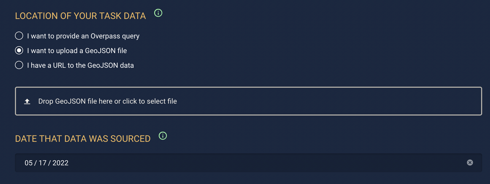

When you create Tasks from a GeoJSON source, MapRoulette asks you to define a date on which the tasks are sourced. This allows you to let mappers know the vintage of the original source data that the task was created from.

By default, the date is set to today. When your GeoJSON is from an external source, this is almost certainly wrong. Please try to determine the vintage of the external data as best you can. This can be a publication date, which may be published on the source's web site. This can help mappers to decide if the Task data is more current than what is already in OSM.